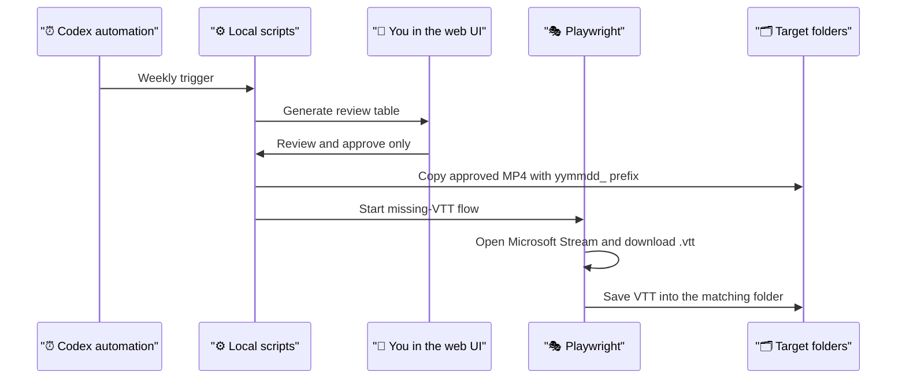

# teams-recording-filing-ops

If your Microsoft Teams recordings keep piling up in OneDrive, and every week you have to:

- decide which folder each recording belongs to
- rename copied files with a date prefix
- avoid re-copying the same recording again
- check whether the transcript `.vtt` already exists
- open Stream and manually download missing transcripts

this repo is for that exact problem.

It is a local-first workflow for Microsoft Teams meeting recordings stored in OneDrive and opened in Microsoft Stream.

## What problem this solves

Without automation, the weekly flow is usually:

1. open the raw `Recordings` folder
2. guess where each `.mp4` should go
3. copy it to the target folder
4. rename it
5. check whether you already copied it before under a different name
6. open Stream
7. open Transcript
8. click `Download as .vtt`
9. save the transcript beside the copied video

That is repetitive, easy to miss, and annoying to review.

This repo turns that weekly mess into a review-first Microsoft Teams recording workflow:

```mermaid
flowchart LR
    Start["📁 Microsoft Teams recordings in OneDrive"]
    Start --> BeforeEntry
    Start --> AfterEntry

    subgraph Before["Before"]
        direction TB
        BeforeEntry["👤 Human starts weekly triage"] --> B2["👤 Guess target folder"]
        B2 --> B3["👤 Check if MP4 was already copied under another name"]
        B3 --> B4["👤 Check if target already has VTT"]
        B4 --> B5["👤 Open Microsoft Stream"]
        B5 --> B6["👤 Open Transcript"]
        B6 --> B7["👤 Download .vtt"]
        B7 --> B8["👤 Rename and copy files by hand"]
    end

    subgraph After["After"]
        direction TB
        AfterEntry["⏰ Codex automation starts weekly review"] --> A2["⚙️ Build review table"]
        A2 --> A3["👤 Review and approve in web UI only"]
        A3 --> A4["⚙️ Copy approved MP4 into the correct folder"]
        A4 --> A5["🎭 Playwright downloads missing VTT from Stream"]
        A5 --> A6["✅ MP4 and VTT end up in the correct folder"]
    end

    classDef before fill:#FFB6C1,stroke:#DC143C,stroke-width:2px,color:black
    classDef human fill:#FFE66D,stroke:#F08C00,stroke-width:2px,color:black
    classDef script fill:#90EE90,stroke:#333,stroke-width:2px,color:darkgreen
    classDef browser fill:#87CEEB,stroke:#333,stroke-width:2px,color:darkblue
    classDef done fill:#E6E6FA,stroke:#333,stroke-width:2px,color:darkblue
    classDef source fill:#E6E6FA,stroke:#333,stroke-width:2px,color:darkblue

    class Start source
    class BeforeEntry,B2,B3,B4,B5,B6,B7,B8 before
    class A3 human
    class AfterEntry,A2,A4 script
    class A5 browser
    class A6 done
```

## What you get

- a review table that auto-populates target folders
- filters for `No VTT`, target folder, search, and review state
- copied MP4 detection so already-moved items can be hidden from the weekly queue
- copied filenames with `yymmdd_` prefix
- transcript status checks against target folders
- Playwright automation that opens Microsoft Stream and downloads missing `.vtt`
- OneDrive space cleanup after copy
- a weekly flow where your only job is web review and approval

## Why review exists

This workflow does not auto-file everything blindly.

The review step exists because Microsoft Teams recording titles are often not reliable enough for fully automatic filing:

- some recordings are obvious from the title
- some recordings are ambiguous
- some recordings were mis-recorded, misnamed, or should go to a different folder this week
- some recordings are short accidental clicks and should be skipped

So the automation does the repetitive work first:

- detect candidate recordings
- suggest the target folder
- detect whether MP4 or VTT may already exist

Then the human does the last judgment call:

- confirm the folder
- skip the wrong or useless recording
- approve the final filing decision

That keeps the repo safe for private working files while still removing almost all of the manual copy-and-download work.

## This repo is specifically for

- Microsoft Teams meeting recordings
- files stored in OneDrive
- transcript download from Microsoft Stream UI
- weekly human review before copy

It is not a generic media library organizer.

## 30-second mental model

## Scope

This repo is intentionally narrow.

It is responsible for:

- reviewing Microsoft Teams recordings before filing
- copying approved MP4 files into the correct folder
- downloading missing VTT files into the same correct folder

It is not responsible for:

- transcript analysis
- meeting summarization
- insight generation
- downstream knowledge workflows

Those can happen after the files are already in the right folders.

## Weekly flow

1. Run `work/recording-approval-ui/generate-recordings-json.ps1`
2. Review in `outputs/recording-approval-ui/index.html`
3. Click `Save`
4. Run `work/recording-approval-ui/run-approved-flow.ps1`

Full weekly operator guide:

- `docs/weekly-runbook.md`

## Post-approval command

After you save approvals, use one command:

`powershell -ExecutionPolicy Bypass -File .\work\recording-approval-ui\run-approved-flow.ps1`

That command will:

- copy approved MP4 files
- prefix copied filenames with `yymmdd_`
- free up OneDrive local space
- download missing VTT files into the matching target folder
- refresh review data so the UI shows the latest state

## File map

| File | What it does | Python-style analogy |
|---|---|---|
| [`config.example.json`](./config.example.json) | Example config template for private local paths, target folders, and routing rules. | Like `.env.example` or a sample `config.yaml` |
| `config.local.json` | Real private local config used during actual runs. | Like a real local config file that is not committed |
| [`package.json`](./package.json) | Project metadata, Node dependency list, and runnable scripts. | Like `pyproject.toml` |
| [`package-lock.json`](./package-lock.json) | Exact locked dependency versions for reproducible installs. | Like `poetry.lock` or `uv.lock` |
| [`outputs/recording-approval-ui/index.html`](./outputs/recording-approval-ui/index.html) | The browser page structure for the review table UI. | Like an HTML template |
| [`outputs/recording-approval-ui/app.js`](./outputs/recording-approval-ui/app.js) | Browser-side UI behavior: table rendering, filters, dropdowns, save, and drag-fill. | Like front-end controller code, not Python |
| [`outputs/recording-approval-ui/styles.css`](./outputs/recording-approval-ui/styles.css) | Visual styling for the local UI. | No direct Python equivalent; UI-only styling |
| [`work/recording-approval-ui/config-loader.ps1`](./work/recording-approval-ui/config-loader.ps1) | Shared config loader used by the PowerShell scripts. | Like `config.py` |
| [`work/recording-approval-ui/generate-recordings-json.ps1`](./work/recording-approval-ui/generate-recordings-json.ps1) | Builds the weekly review dataset by scanning recordings, targets, and existing filed files. | Like `build_recordings_json.py` |
| [`work/recording-approval-ui/copy-approved-recordings.ps1`](./work/recording-approval-ui/copy-approved-recordings.ps1) | Copies approved MP4 files into the chosen target folders safely. | Like `copy_approved_recordings.py` |
| [`work/recording-approval-ui/download-missing-vtt.ps1`](./work/recording-approval-ui/download-missing-vtt.ps1) | PowerShell entrypoint for the missing-VTT download flow. | Like a thin runner script |
| [`work/recording-approval-ui/download-missing-vtt.mjs`](./work/recording-approval-ui/download-missing-vtt.mjs) | Playwright browser automation that opens Stream and downloads missing `.vtt` files. | Like `playwright_script.py` or `selenium_script.py` |
| [`work/recording-approval-ui/run-approved-flow.ps1`](./work/recording-approval-ui/run-approved-flow.ps1) | One-command post-approval pipeline: copy MP4, fetch VTT, refresh data. | Like `main.py` or `run_pipeline.py` |
| [`docs/weekly-runbook.md`](./docs/weekly-runbook.md) | Operator guide for the weekly flow. | Like an operations runbook |
| [`docs/recording-automation-overview.md`](./docs/recording-automation-overview.md) | Higher-level architecture and workflow explanation. | Like a design note |

## Notes

- Source recordings live outside this repo in OneDrive.
- Copy `config.example.json` to `config.local.json` and fill in your private local paths.
- Put title-to-folder routing rules in `config.local.json` under `routingRules`.
- Generated `recordings.json` and `recordings.js` are local working data and should not be committed.
- Saved approval files may contain private file metadata and should not be committed by default.
