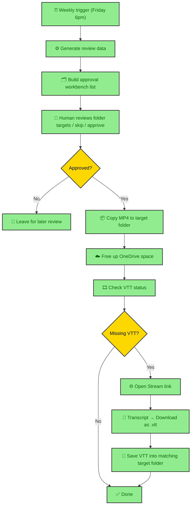
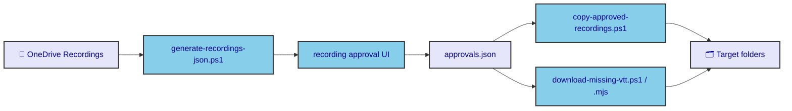
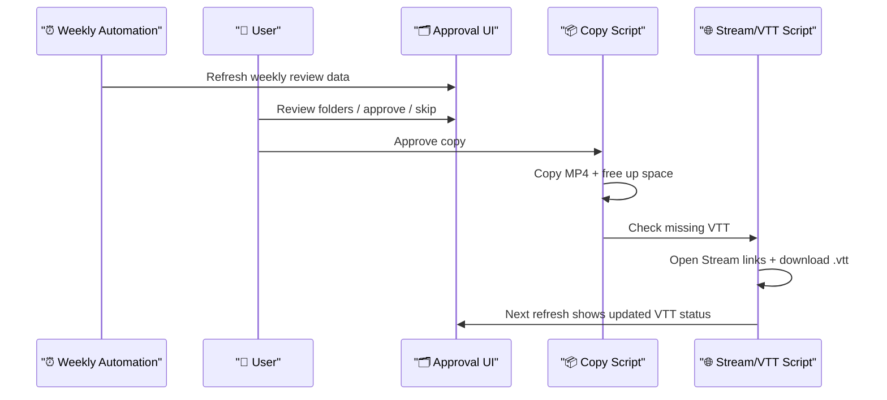

# Recording Automation Overview

This repo automates a weekly recording operations flow for OneDrive-hosted meeting recordings.

## What it does

1. Refreshes a weekly review list from the source `Recordings` folder.
2. Lets a human review target-folder decisions in a local approval workbench.
3. After approval, copies MP4 files to the chosen target folders with a `yymmdd_` prefix.
4. Frees local disk space in OneDrive target folders after copy.
5. Detects whether matching VTT files already exist in target folders.
6. Can batch-open Stream links and download missing VTT files into the matching target folders.

## Weekly flow

## Main parts

## Human approval boundary

## Files

- `outputs/recording-approval-ui/index.html`
- `outputs/recording-approval-ui/app.js`
- `work/recording-approval-ui/generate-recordings-json.ps1`
- `work/recording-approval-ui/copy-approved-recordings.ps1`
- `work/recording-approval-ui/download-missing-vtt.ps1`
- `work/recording-approval-ui/download-missing-vtt.mjs`

## Current assumptions

- Source recordings live in OneDrive `Recordings`.
- Target folders are OneDrive folders maintained by the user.
- MP4 copied-state matching is heuristic.
- VTT download uses browser automation against Stream UI, not Graph API.
- Microsoft login may be required once in the automation browser profile.
