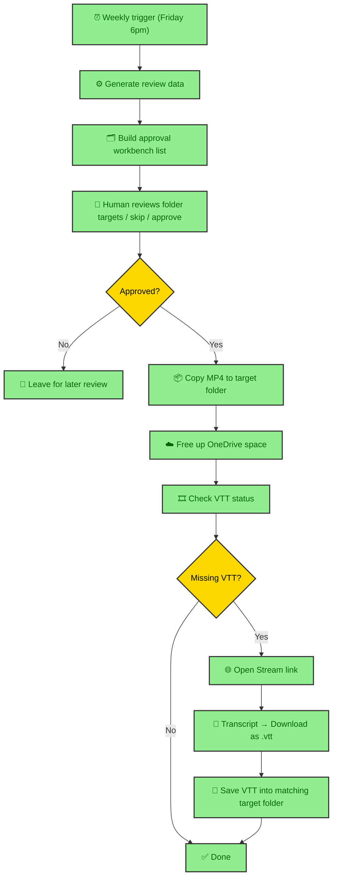
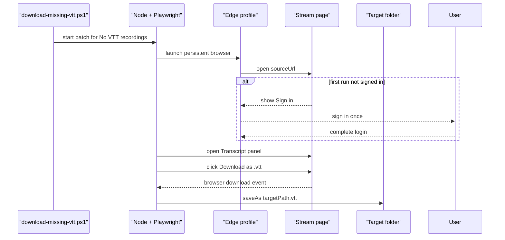
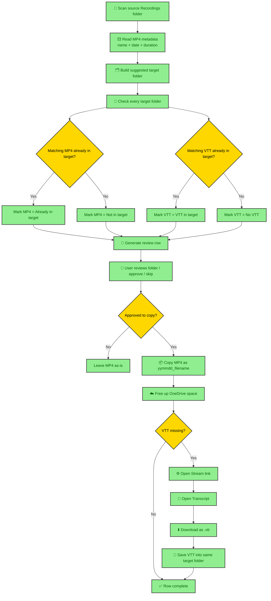
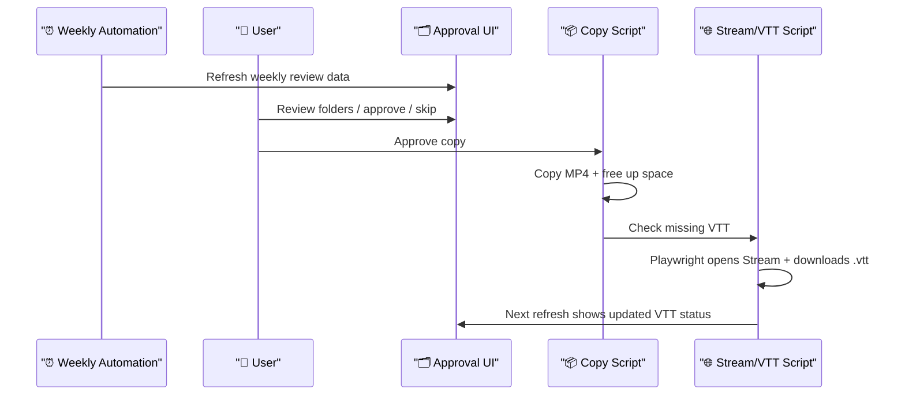

# Recording Automation Overview

This repo automates a weekly recording operations flow for OneDrive-hosted meeting recordings.

## What it does

1. Refreshes a weekly review list from the source `Recordings` folder.
2. Lets a human review target-folder decisions in a local approval workbench.
3. After approval, copies MP4 files to the chosen target folders with a `yymmdd_` prefix.
4. Frees local disk space in OneDrive target folders after copy.
5. Detects whether matching VTT files already exist in target folders.
6. Can batch-open Stream links and download missing VTT files into the matching target folders.

## Weekly flow

## Main parts

Purpose:
show the system components and handoff boundaries at a glance.

How to read:
read left to right.
Storage and inputs are on the left, local scripts and UI are in the middle, browser automation is on the right, and final outputs land in target folders.

```mermaid
flowchart LR
    Source["📁 OneDrive Recordings"] --> Generator["generate-recordings-json.ps1"]
    Generator --> UI["recording approval UI"]
    UI --> Approvals["approvals.json"]
    Approvals --> Copier["copy-approved-recordings.ps1"]
    Approvals --> VttBot["download-missing-vtt.ps1"]
    VttBot --> Playwright["🎭 Playwright runner"]
    Playwright --> Edge["🌐 Edge persistent profile"]
    Edge --> Stream["📺 Stream web UI"]
    Copier --> Targets["🗂️ Target folders"]
    Stream --> VttSave["💾 saveAs .vtt"]
    VttSave --> Targets

    classDef primary fill:#87CEEB,stroke:#333,stroke-width:2px,color:darkblue
    classDef storage fill:#E6E6FA,stroke:#333,stroke-width:2px,color:darkblue
    classDef web fill:#FFD700,stroke:#333,stroke-width:2px,color:black
    class Source,Targets,Approvals storage
    class Generator,UI,Copier,VttBot,Playwright,VttSave primary
    class Edge,Stream web
```

## VTT download path

Purpose:
show exactly how the missing-VTT automation works once the batch downloader starts.

How to read:
read top to bottom.
This is the detailed runtime path for one recording: launch browser, open Stream, sign in if needed, open transcript, download `.vtt`, then save to the target folder.

## Current logic flow

Purpose:
show the decision logic behind the current workflow, including what is inferred automatically and what still needs human approval.

How to read:
start at the top and follow the arrows.
Diamonds are decisions. Green boxes are actions. This is the best diagram to read when you want to understand "why did this row show up like this in the UI?"

## Current matching rules

Purpose:
document the exact heuristics behind the automation, so future changes are made intentionally instead of by guesswork.

- MP4 already copied:
  scan target folders for `.mp4`, then match by `date token + duration`.
- VTT already copied:
  first try exact expected names, then try `date token + normalized title`.
- Target folder suggestion:
  infer from recording name keywords like `Git`, `SQL`, `GenAI`, `Gina & Sinyee`, `Thomas`, `MI Finance`.
- Copy naming:
  always use `yymmdd_` prefix for copied MP4.
- VTT download target:
  if copied MP4 path is known, save `.vtt` beside that MP4; otherwise fall back to approved/suggested target folder.

## Human approval boundary

Purpose:
show where automation stops and where the user still makes the call.

How to read:
read top to bottom by actor.
This is the ownership view: weekly automation prepares, the user reviews and approves, then automation resumes for copy and transcript fetch.

## Files

- `outputs/recording-approval-ui/index.html`
- `outputs/recording-approval-ui/app.js`
- `work/recording-approval-ui/generate-recordings-json.ps1`
- `work/recording-approval-ui/copy-approved-recordings.ps1`
- `work/recording-approval-ui/download-missing-vtt.ps1`
- `work/recording-approval-ui/download-missing-vtt.mjs`

## Current assumptions

- Source recordings live in OneDrive `Recordings`.
- Target folders are OneDrive folders maintained by the user.
- MP4 copied-state matching is heuristic.
- VTT download uses browser automation against Stream UI, not Graph API.
- Microsoft login may be required once in the automation browser profile.
